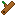
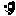

# Icons

Icons are the main mechanic of the slot machine. Different combinations of icons provide different [payouts](payouts.md).


## List of Icons

###  Organic Icons
<div class="grid cards" markdown>
- [Wood](index.md)
- [Sap](index.md)
- [Vine](index.md)
- [Mushroom](index.md)
- [Glowing Mushroom](index.md)
</div>

###  Mineral Icons
<div class="grid cards" markdown>
- [Dirt](index.md)
- [Sand](index.md)
- [Ruby](index.md)
- [Sapphire](index.md)
- [Emerald](index.md)
</div>

###  Metal Icons
<div class="grid cards" markdown>
- [Copper](index.md)
- [Tin](index.md)
- [Iron](index.md)
- [Sulfur](index.md)
- [Gold](index.md)
- [Silver](index.md)
- [Platinum](index.md)
- [Cobalt](index.md)
- [Tungsten](index.md)
- [Uranium](index.md)
</div>

###  Relic Icons
<div class="grid cards" markdown>
- [Ancient Coin](index.md)
- [Human Skull](index.md)
- [Plastic](index.md)
- [Pottery Sherd](index.md)
- [Pterosaur Fossil](index.md)
- [Tyrannosauridae Fossil](index.md)
</div>

###  Alien Icons
<div class="grid cards" markdown>
- [Alien Egg](index.md)
- [Alien Skull](index.md)
- [Broken Alien Weapon](index.md)
- [UFO Hull Piece](index.md)
</div>

###  Wild Icons
Only one of each wild icon can be in the slot machine at one time.
<div class="grid cards" markdown>
- [Clown](index.md)
- [Joker](index.md)
- [Jokesmith](index.md)
- [Prankster](index.md)
</div>

###  Curse Icons
<div class="grid cards" markdown>
- [Bomb](index.md)
- [Durian](index.md)
- [Loan Shark](index.md)
- [Mafia Man](index.md)
- [Wraith](index.md)
</div>


## Modding Tutorial


## Developer Information

Icons are imported from `.json` files located in the `res://Data/Icons` folder. Each `.json` file must define a set of properties for the icon. Invalid information is discarded. The following fields are parsed:

``` json
tag                 Required. If missing, the icon will NOT be imported.
category            Required. If missing, the icon will NOT be imported.

name                Optional. Defaults to "icon/[tag]".
category_name       Optional. Defaults to "category/[category]".
set_name            Optional. Defaults to "set/[set]".
texture             Optional. Defaults to "res://Slot Machine/Assets/Sprites/Icons/icon_[tag].png". If missing, a NULL texture is assigned.
```
***Note***: `name` and `category_name` are expected to correspond to localization keys. If not present in `localization.csv`, they may appear incorrectly in-game.

Here is an example of an icon in a `.json` file:
``` json
{
    {
        "tag" : "wood",
        "category" : "organic",
    }
}
```