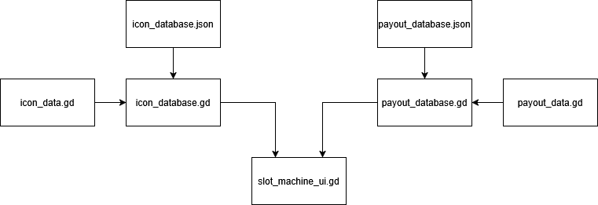

# Slot Machine

The following is an explanation for how the slot machine and the various scripts responsible for the slot machine work.

## Visual Representation

{.auto}

## Icons

Icon data is stored as JSON files in the `res://Data/Icons` directory. This JSON data is then loaded by `icon_database.gd` and converted from JSON to an IconData Godot Resource, which is defined in `icon_data.gd`. All of the loaded IconData information is stored in the `icons` dictionary, which is accessible using `IconDB.icons[icon_tag]`.

## Payouts

Payout data is stored as JSON files in the `res://Data/Payouts` directory. This JSON data is then loaded by `payout_database.gd` and converted from JSON to a PayoutData Godot Resource, which is defined in `payout_data.gd`. All of the loaded PayoutData information is then stored in two dictionaries, `payouts_by_tag` and `payouts_by_match`. These two dictionaries are identical except for the key used to define the data; one uses the tag, and the other uses the match string defined in `payout_data.gd`. Data is accessible using `PayoutDB.payouts_by_tag[payout_tag]` or `PayoutDB.payouts_by_match[match_string]`.

The reason two dictionaries exist is that `payouts_by_tag` is better for human readable purposes, like searching for information about a certain payout, while `payouts_by_match` is better for processing in the slot machine, since rather than looping through each dictionary key value pair, the slot machine can quickly search for the match key instead.

## The Slot Machine

The slot machine then accesses information from the icon and payout databases using various accessors defined in their resource or database files.