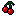
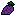
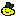
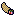

# Icons

Icons are the main mechanic of the slot machine. Different combinations of icons provide different [payouts](payouts.md), and can provide money or [items](items.md). 
<br><br>


## Default Icons
The slot machine starts with 7 icons:
    
    
    
    
    
    
    
<br><br>


## Icon Types
<span class="cat-fruit">Fruit</span> icons give the player money for the current run. 
<br>

<span class="cat-weapon">Weapon</span> and <span class="cat-ability">Ability</span> icons give the player [items](items.md) for the current run.
<br>

<span class="cat-wild">Wild</span> icons count as every icon at the same time, excluding wild icons and curse icons.
<br>

<span class="cat-curse">Curse</span> icons negatively impact the player by adding to their debt, removing icons, or adding additional curse icons.
<br><br>


## Icon Rarity
Each icon has a `rarity` value defined in its metadata, represented as an integer. This integer maps to a named rarity (e.g., **Common**, **Uncommon**, etc.) for ease of communication. Additionally, each rarity is assigned a `commonality` value that determines how likely it is to appear in the slot machine. Items can alter an item's commonality.

When the reels are reset, a weighted reel pool is built based on these commonality values. For example, if **Common** has a commonality of 5 and **Rare** has a commonality of 1, the chance of selecting a **Common** icon is 5/6, while **Rare** has a 1/6 chance.

| Rarity Variable | Rarity Name | Rarity Commonality |
| :-------------: | :---------: | :----------------: |
| 1 | <span class="rarity-common">Common</span> | 50 |
| 2 | <span class="rarity-uncommon">Uncommon</span> | 35 |
| 3 | <span class="rarity-rare">Rare</span> | 14 |
| 4 | <span class="rarity-legendary">Legendary</span> | 1 |

<br><br>


## Icon List
| Icon | Category | Rarity |
| :--: | :------: | :----: |
| <br>Cherry | <span class="cat-fruit">Fruit</span> | <span class="rarity-common">Common</span> |
| <br>Grapes | <span class="cat-fruit">Fruit</span> | <span class="rarity-uncommon">Uncommon</span> |
| <br>Lemon | <span class="cat-fruit">Fruit</span> | <span class="rarity-rare">Rare</span> |
| <br>Cornucopia | <span class="cat-fruit">Fruit</span> | <span class="rarity-legendary">Legendary</span> |
| <br>Spoon | <span class="cat-weapon">Weapon</span> | <span class="rarity-uncommon">Uncommon</span> |
| <br>Joker | <span class="cat-wild">Wild</span> | <span class="rarity-legendary">Legendary</span> |
| <br>Mafia Man | <span class="cat-curse">Curse</span> | <span class="rarity-rare">Rare</span> |

<br>


## Developer Information

Icons are imported from `.json` files located in the `res://Data/Icons` folder. Each `.json` file must define a set of properties for the icon. Invalid information is discarded. The following fields are parsed:

``` json
tag                 Required. If missing, the icon will NOT be imported.
category            Recommended. If missing, defaults to "NULL".
set                 Recommended. If missing, defaults to "NULL".
rarity              Recommended. Defaults to -1.

name                Optional. Defaults to "icon/[tag]".
category_name       Optional. Defaults to "category/[category]".
set_name            Optional. Defaults to "set/[set]".
texture             Optional. Defaults to "res://Data/Icons/Sprites/icon_[tag].png". If missing, a NULL texture is assigned.
in_machine          Optional. Defaults to "false".
```
***Note***: `name`, `category_name`, and `set_name` are expected to correspond to localization keys. If not present in `localization.csv`, they may appear incorrectly in-game.

Here is an example of an icon in a `.json` file:
``` json
{
    {
        "tag" : "cherry",
        "category" : "fruit",
        "set" : "set_1",
        "rarity" : 1,
        "in_machine" : true,
    }
}
```